## MAK-UNK-e4a-25_ACR2

* SMILES: *CCC(=O)N1CC[NH+](Cc2nc(C)[nH]c(=O)c2CCCc2ccsc2)CC1
* hits: x0387,x0692
* atom count: 16 common with hits out of 27

| model | RMSD [Å] | Score [kcal/mol] |
| --- | --- | --- |
| placed | 0.971026191 | 490.1467677 | 
| minimised | 4.365060725 | -0.038664849 | 
| docked | 4.365209284 | -0.170757111 | 

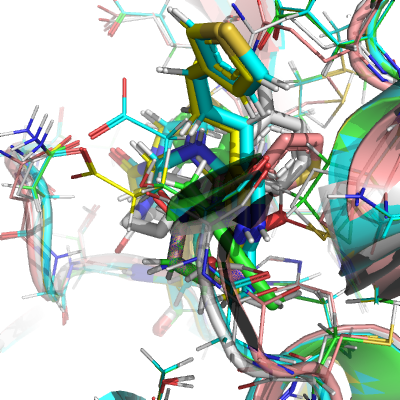
## NIR-THE-0d6-7_ACR2

* SMILES: *CCC(=O)N1CCC(Nc2cc(C#N)cnc2NCC)CC1
* hits: x0104,x0161,x0195,x0305,x0692,x0770,x0830,x1334
* atom count: 12 common with hits out of 22

| model | RMSD [Å] | Score [kcal/mol] |
| --- | --- | --- |
| placed | 1.110728126 | 99.13498999 | 
| minimised | 6.540067688 | -0.041953207 | 
| docked | 6.177558158 | 0.187337935 | 

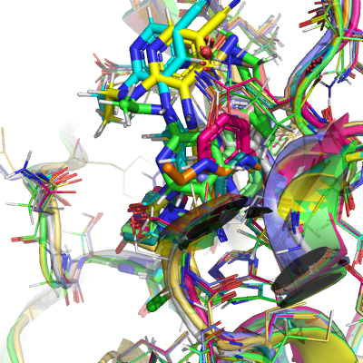
## TAM-UNI-c14-2_ACR3

* SMILES: *CCC(=O)NCCc1c[nH]c2c(CC(=O)Nc3ccncc3)cc(F)cc12
* hits: x0072,x0104,x0195,x0434,x0678,x0946,x1093
* atom count: 24 common with hits out of 27

| model | RMSD [Å] | Score [kcal/mol] |
| --- | --- | --- |
| placed | 1.048753385 | 164.3495995 | 
| minimised | 5.056452695 | -0.044863536 | 
| docked | 5.392783357 | 1.649102558 | 

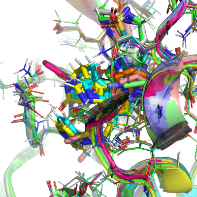
## JOH-CHE-350-2_ACR3

* SMILES: *CCC(=O)NCCc1c[nH]c2c1cc(Cl)c1cc(CCCC(=N)N)sc12
* hits: x0072,x0104,x0991
* atom count: 17 common with hits out of 26

| model | RMSD [Å] | Score [kcal/mol] |
| --- | --- | --- |
| placed | 0.404247449 | 4673.463679 | 
| minimised | 3.900880359 | -0.052720782 | 
| docked | 3.603917591 | 4.301691163 | 

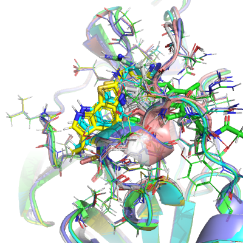
## MAK-UNK-af8-30_NIT2

* SMILES: *C(=N)CN1CC[NH+](C[NH2+]C2C(O)OC(c3ccc(NCC)nc3)C(O)C2O)CC1
* hits: x0072,x0104,x0161,x0195,x0305,x0387,x0692
* atom count: 16 common with hits out of 29

| model | RMSD [Å] | Score [kcal/mol] |
| --- | --- | --- |
| placed | 1.148292667 | 381.1652757 | 
| minimised | 6.109158232 | -0.077055258 | 
| docked | 6.023128786 | 1.126453105 | 

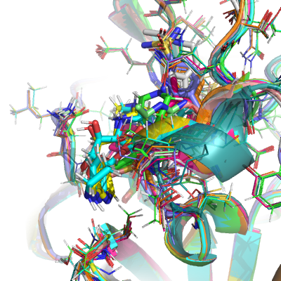
## JON-UIO-066-13_ACR3

* SMILES: *CCC(=O)NC(c1cc(F)cc(S(N)(=O)=O)c1)C(C)F
* hits: x0689,x0769,x0831,x1382
* atom count: 10 common with hits out of 20

| model | RMSD [Å] | Score [kcal/mol] |
| --- | --- | --- |
| placed | 0.925162436 | 457.3154654 | 
| minimised | 3.687891019 | -0.085707449 | 
| docked | 3.543667451 | 1.262341298 | 

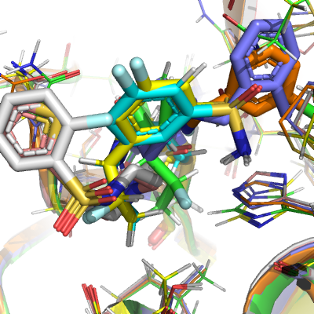
## MAK-UNK-902-13_NIT3

* SMILES: *C(=N)CN1CCN(C(OC(=O)c2cccc(NS(C)(=O)=O)c2)c2ccsc2)CC1
* hits: x1386,x1418
* atom count: 14 common with hits out of 29

| model | RMSD [Å] | Score [kcal/mol] |
| --- | --- | --- |
| placed | 0.959272398 | 3753.546185 | 
| minimised | 9.353444681 | -0.12239441 | 
| docked | 9.594857265 | 1.795463088 | 

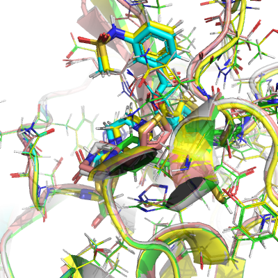
## DAR-DIA-fb2-4_ACR2

* SMILES: *CCC(=O)N1CCN(Cc2cc(C#N)cnc2NCC)CC1
* hits: x0104,x0195,x0305,x0830
* atom count: 16 common with hits out of 22

| model | RMSD [Å] | Score [kcal/mol] |
| --- | --- | --- |
| placed | 0.992280574 | 322.4397027 | 
| minimised | 5.422673304 | -0.136004203 | 
| docked | 5.437659585 | 0.109092838 | 

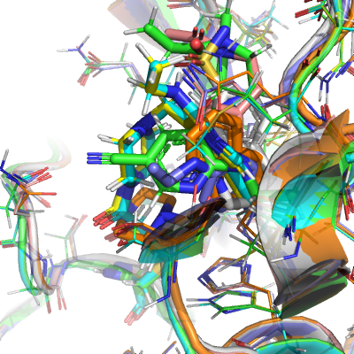
## PAU-WEI-f73-2_ACR2

* SMILES: *CCC(=O)N1CCN(C(c2ccc(Br)s2)c2cc(C#N)ccc2CNC(=O)N2CCOCC2)CC1
* hits: x0104,x0305,x0830,x1249,x1385
* atom count: 27 common with hits out of 35

| model | RMSD [Å] | Score [kcal/mol] |
| --- | --- | --- |
| placed | 1.115808063 | 3001.115604 | 
| minimised | 2.943766091 | -0.142859935 | 
| docked | 3.046139229 | 1.104266907 | 

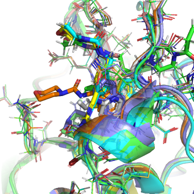
## TAM-UNI-d1c-16_ACR2

* SMILES: *CCC(=O)N1CCN(Cc2cc(C#N)cc(NC(C)=O)c2)CC1
* hits: x0692,x1382,x1386,x1392
* atom count: 20 common with hits out of 23

| model | RMSD [Å] | Score [kcal/mol] |
| --- | --- | --- |
| placed | 0.685274993 | 963.8853643 | 
| minimised | 2.77618373 | -0.144139729 | 
| docked | 3.013102165 | 1.985220977 | 

## BEN-VAN-c98-1_ACR3

* SMILES: *CCC(=O)N1CCN(Cc2ccc(-c3cc(C)ncn3)c(Br)c2)CC1
* hits: x0692,x0770,x0995
* atom count: 17 common with hits out of 25

| model | RMSD [Å] | Score [kcal/mol] |
| --- | --- | --- |
| placed | 0.918274411 | 4228.856158 | 
| minimised | 3.378754154 | -0.163369679 | 
| docked | 3.381149898 | 0.060171054 | 

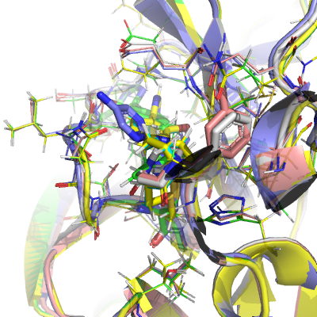
## TAM-UNI-d1c-16_NIT2

* SMILES: *C(=N)CN1CCN(Cc2cc(C#N)cc(NC(C)=O)c2)CC1
* hits: x0692,x1382,x1386,x1392
* atom count: 20 common with hits out of 22

| model | RMSD [Å] | Score [kcal/mol] |
| --- | --- | --- |
| placed | 0.937348116 | 1127.489274 | 
| minimised | 4.501764969 | -0.190726291 | 
| docked | 4.388205491 | -0.485341959 | 

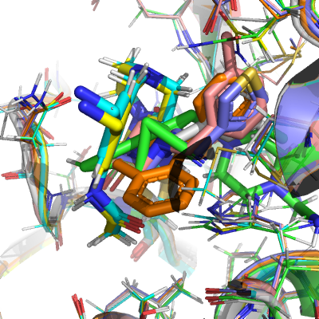
## DAN-PUR-390-1_ACR3

* SMILES: *CCC(=O)N1CCN(C(=O)CCl)C[C@@H]1CC(N)=O
* hits: x0991,x1311,x1493
* atom count: 14 common with hits out of 18

| model | RMSD [Å] | Score [kcal/mol] |
| --- | --- | --- |
| placed | 0.791707269 | 515.324582 | 
| minimised | 4.855797185 | -0.194674205 | 
| docked | 5.19983585 | 2.001070627 | 

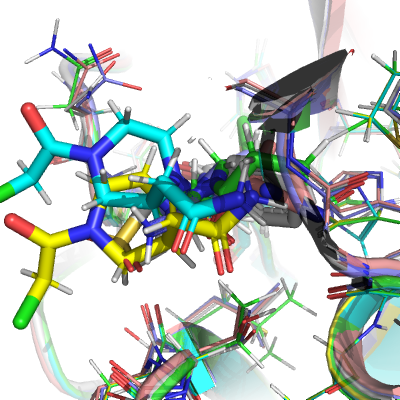
## MAK-UNK-8fd-23_NIT2

* SMILES: *C(=N)CN1CCC(C(=O)N(c2ccc(S(=O)(=O)n3cc(C[NH2+]C)cc3-c3ccccc3F)cn2)C(C)C)CC1
* hits: x0305
* atom count: 10 common with hits out of 39

| model | RMSD [Å] | Score [kcal/mol] |
| --- | --- | --- |
| placed | 0.329164473 | 6158.613122 | 
| minimised | 9.284576794 | -0.199841243 | 
| docked | 9.188947668 | 1.384398237 | 

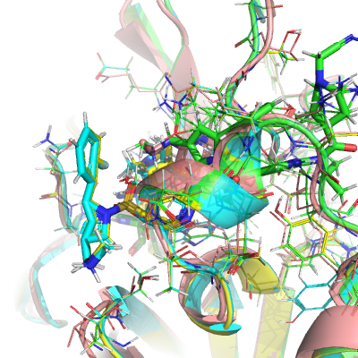
## KEI-UNI-85a-10_NIT3

* SMILES: *C(=N)CN1CCN(Cc2ccc3nc(S(N)(=O)=O)ccc3c2C)C[C@@H](c2cccnc2)C1
* hits: x0104,x0434,x0678,x0831,x0946
* atom count: 27 common with hits out of 32

| model | RMSD [Å] | Score [kcal/mol] |
| --- | --- | --- |
| placed | 0.749541577 | 822.7903014 | 
| minimised | 4.50911124 | -0.203098431 | 
| docked | 4.82057626 | 0.03508397 | 

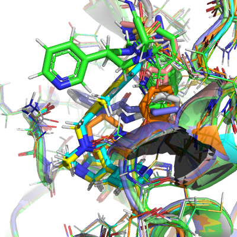
## SAL-INS-68b-10_ACR3

* SMILES: *CCC(=O)N[C@@H](CO)C(=O)N[C@@H](Cc1c[nH]c2ccccc12)C(=O)N[C@H](CO)C(=O)N[C@@H](CCCNC(N)=O)C(N)=O
* hits: x0874
* atom count: 11 common with hits out of 42

| model | RMSD [Å] | Score [kcal/mol] |
| --- | --- | --- |
| placed | 0.765617235 | 1532.472523 | 
| minimised | 2.50070795 | -0.205326402 | 
| docked | 2.348118609 | 4.136895964 | 

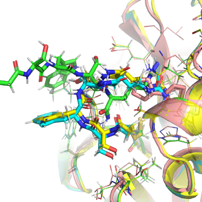
## MAK-UNK-902-8_ACR3

* SMILES: *CCC(=O)N1CCN(C(C(=O)N2CCN(S(=O)(=O)c3cccc(F)c3)CC2)c2ccsc2)CC1
* hits: x1386,x1418
* atom count: 15 common with hits out of 34

| model | RMSD [Å] | Score [kcal/mol] |
| --- | --- | --- |
| placed | 0.554365353 | 898.3976293 | 
| minimised | 3.925320291 | -0.211729825 | 
| docked | 3.684089176 | 2.308291164 | 

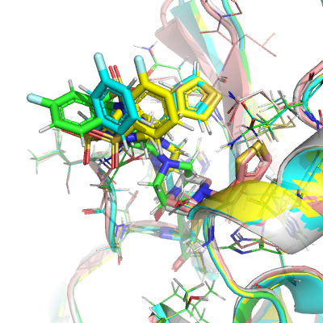
## PAU-WEI-b9b-8_ACR3

* SMILES: *CCC(=O)NCCc1c[nH]c2c(C(CCc3ccc(C)cc3)N3CCN(C(=O)CCl)CC3)cccc12
* hits: x0104,x0305,x0770,x1380,x1385
* atom count: 29 common with hits out of 36

| model | RMSD [Å] | Score [kcal/mol] |
| --- | --- | --- |
| placed | 1.02628928 | 2996.426557 | 
| minimised | 8.201258329 | -0.242356428 | 
| docked | 8.187955942 | 4.371358642 | 

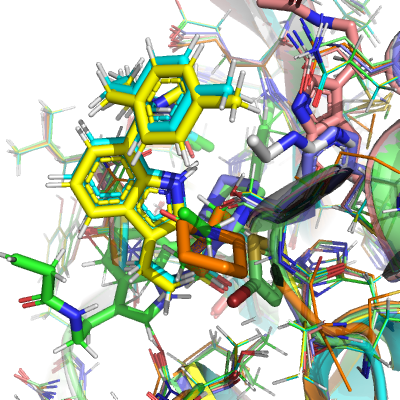
## NIM-UNI-022-2_ACR3

* SMILES: *CCC(=O)N(Cc1cn(CC(=O)Nc2cccnc2)nn1)C1CCS(=O)(=O)C1
* hits: x0195,x0434,x0770,x1374
* atom count: 24 common with hits out of 28

| model | RMSD [Å] | Score [kcal/mol] |
| --- | --- | --- |
| placed | 0.712570305 | 1695.951035 | 
| minimised | 5.625770351 | -0.293788395 | 
| docked | 5.573635801 | 0.322953166 | 

## NIM-UNI-bb6-2_ACR2

* SMILES: *CCC(=O)N(Cc1cn(CC(=O)Nc2cccnc2)nn1)C1CCS(=O)(=O)C1
* hits: x0195,x0434,x0770,x1374
* atom count: 24 common with hits out of 28

| model | RMSD [Å] | Score [kcal/mol] |
| --- | --- | --- |
| placed | 0.837629459 | 1177.813778 | 
| minimised | 5.546391894 | -0.311016173 | 
| docked | 5.511291782 | 0.376334984 | 

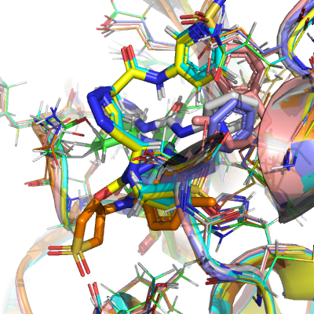
## TAM-UNI-d1c-13_NIT2

* SMILES: *C(=N)CN1CCN(Cc2cccc3c2CN(C(C)=O)CCC3)CC1
* hits: x0692,x1382,x1386,x1392
* atom count: 19 common with hits out of 24

| model | RMSD [Å] | Score [kcal/mol] |
| --- | --- | --- |
| placed | 0.912703262 | 2479.620207 | 
| minimised | 4.747544175 | -0.325828955 | 
| docked | 4.793085854 | -0.244113396 | 

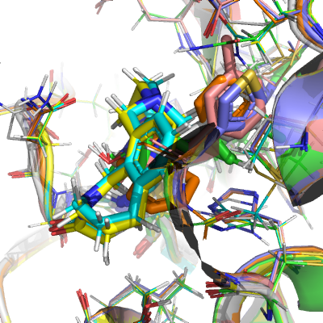
## MAK-UNK-8fd-30_NIT2

* SMILES: *C(=N)CN1CCC(C(=O)N(c2ccc(F)c(-c3cc(C[NH2+]C)cn3S(=O)(=O)c3cccnc3)c2)C(C)C)CC1
* hits: x0305
* atom count: 8 common with hits out of 39

| model | RMSD [Å] | Score [kcal/mol] |
| --- | --- | --- |
| placed | 1.101896955 | 5975.296247 | 
| minimised | 7.186949979 | -0.336470366 | 
| docked | 7.213184373 | -0.036193517 | 

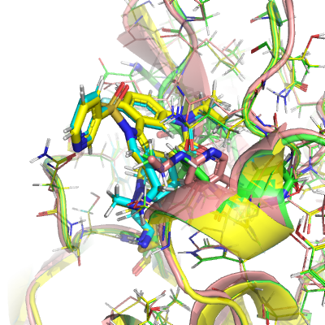
## DAR-DIA-fb2-15_NIT2

* SMILES: *C(=N)CN1CCN(Cc2cc(Cl)cc3c(CCNC(C)=O)c[nH]c23)CC1
* hits: x0104,x0195,x0305,x0830
* atom count: 24 common with hits out of 26

| model | RMSD [Å] | Score [kcal/mol] |
| --- | --- | --- |
| placed | 1.137685837 | 867.7736472 | 
| minimised | 3.648178626 | -0.341186274 | 
| docked | 3.795406035 | -0.65216475 | 

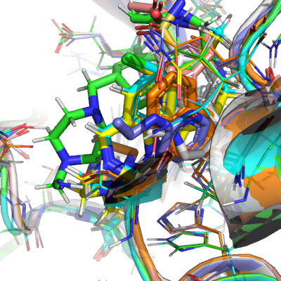
## DOU-UNK-b53-4_ACR3

* SMILES: *CCC(=O)N1C(CNS(=O)(=O)c2ccc(C)cc2)CN(C(O)c2cccs2)C2CC(=O)N(c3cnccc3C)C21
* hits: x0104,x0107,x0387,x0397,x0708,x0770,x1093,x1392
* atom count: 22 common with hits out of 40

| model | RMSD [Å] | Score [kcal/mol] |
| --- | --- | --- |
| placed | 1.032416977 | 3855.941848 | 
| minimised | 7.053926493 | -0.344683813 | 
| docked | 7.085791513 | 0.485175956 | 

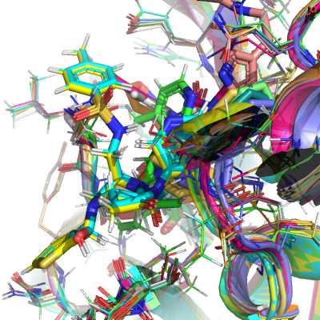
## TAM-UNI-d1c-13_ACR3

* SMILES: *CCC(=O)N1CCCc2cccc(CN3CCN(C(=O)CCl)CC3)c2C1
* hits: x0692,x1382,x1386,x1392
* atom count: 20 common with hits out of 26

| model | RMSD [Å] | Score [kcal/mol] |
| --- | --- | --- |
| placed | 0.855412969 | 1325.642967 | 
| minimised | 6.043077288 | -0.348990093 | 
| docked | 6.111132422 | 0.679264795 | 

## PAU-WEI-b9b-9_ACR2

* SMILES: *CCC(=O)N1CCN(C(CCc2ccc(C(F)(F)F)cc2)c2cccc3c(CCNC(C)=O)c[nH]c23)CC1
* hits: x0104,x0305,x0770,x1380,x1385
* atom count: 29 common with hits out of 38

| model | RMSD [Å] | Score [kcal/mol] |
| --- | --- | --- |
| placed | 0.928752511 | 229.3001684 | 
| minimised | 9.903514542 | -0.357502798 | 
| docked | 9.764644299 | 2.225998347 | 

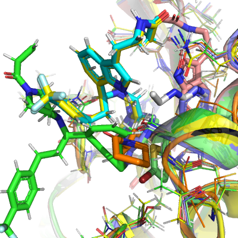
## GAB-REV-70c-21_ACR3

* SMILES: *CCC(=O)Nc1ccc(NCC(=O)Nc2cnccc2C)cc1
* hits: x0107
* atom count: 11 common with hits out of 23

| model | RMSD [Å] | Score [kcal/mol] |
| --- | --- | --- |
| placed | 0.544543744 | 2231.233081 | 
| minimised | 2.775788016 | -0.362867538 | 
| docked | 2.680072159 | 0.806020877 | 

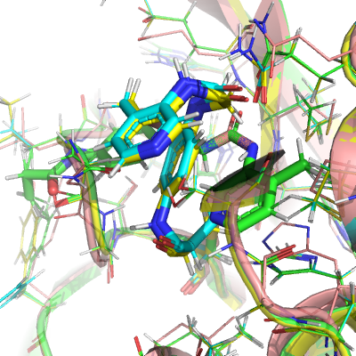
## BEN-VAN-77c-8_NIT3

* SMILES: *C(=N)CN1CCO[C@@H](c2cc(F)c(F)cc2C[C@H](C)Nc2ccc(C#N)cn2)C1
* hits: x0759,x1478
* atom count: 15 common with hits out of 29

| model | RMSD [Å] | Score [kcal/mol] |
| --- | --- | --- |
| placed | 0.849633791 | 57.25634102 | 
| minimised | 2.899284331 | -0.363892065 | 
| docked | 2.907275438 | -0.665581896 | 

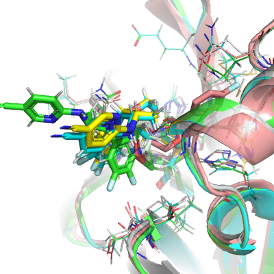
## GAB-REV-4a4-12_ACR3

* SMILES: *CCC(=O)NCCc1c[nH]c2c(NS(=O)(=O)Cc3ccc4[nH]ncc4c3)cc(F)cc12
* hits: x0104
* atom count: 16 common with hits out of 31

| model | RMSD [Å] | Score [kcal/mol] |
| --- | --- | --- |
| placed | 0.885851209 | 2845.248556 | 
| minimised | 5.510268736 | -0.373914129 | 
| docked | 5.420290625 | 0.047230698 | 

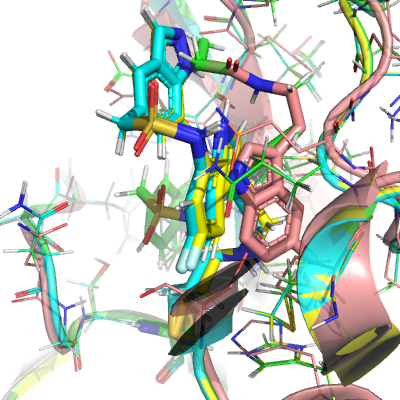
## TAM-UNI-d1c-12_ACR2

* SMILES: *CCC(=O)N1CCN(Cc2cccc(CNC(=O)N3CCOCC3)c2)CC1
* hits: x0692,x1382,x1386,x1392
* atom count: 17 common with hits out of 27

| model | RMSD [Å] | Score [kcal/mol] |
| --- | --- | --- |
| placed | 0.936585197 | 1599.458232 | 
| minimised | 3.466015211 | -0.380747269 | 
| docked | 3.691970304 | 0.043633184 | 

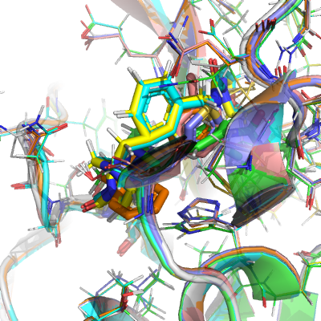
## MAK-UNK-105-1_ACR3

* SMILES: *CCC(=O)NCC(c1c[nH]c2ccc(F)cc12)N1CCN(C(=O)Cc2c[nH]c3ncccc23)CC1
* hits: x0104,x1093
* atom count: 33 common with hits out of 35

| model | RMSD [Å] | Score [kcal/mol] |
| --- | --- | --- |
| placed | 0.746645658 | 3703.069743 | 
| minimised | 7.403985029 | -0.388033732 | 
| docked | 7.326831915 | -0.107578142 | 

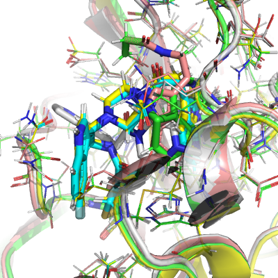
## SAL-INS-1ea-1_ACR2

* SMILES: *CCC(=O)N1CCN(S(=O)(=O)c2ccc(Cl)cc2)C[C@@H]1Oc1ccc(F)cc1
* hits: x0759,x1308,x1358,x1402
* atom count: 19 common with hits out of 28

| model | RMSD [Å] | Score [kcal/mol] |
| --- | --- | --- |
| placed | 0.958770806 | 1678.947754 | 
| minimised | 6.962004523 | -0.394178363 | 
| docked | 6.880118205 | 1.166759585 | 

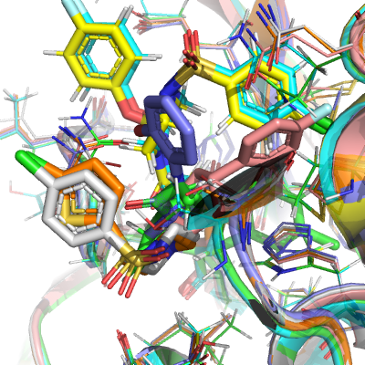
## MAK-UNK-643-2_ACR3

* SMILES: *CCC(=O)N1CCN(Cc2cccs2)CC1
* hits: x0689
* atom count: 9 common with hits out of 16

| model | RMSD [Å] | Score [kcal/mol] |
| --- | --- | --- |
| placed | 0.652688202 | 1563.686616 | 
| minimised | 2.260863847 | -0.39692777 | 
| docked | 2.251928704 | 1.265225406 | 

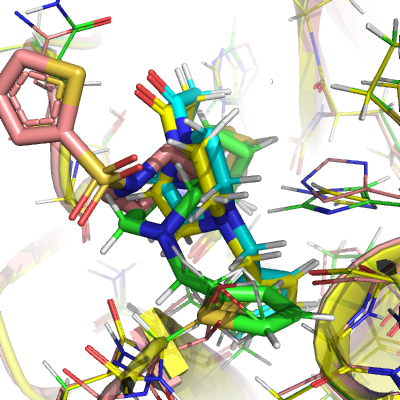
## MAK-UNK-af8-9_NIT2

* SMILES: *C(=N)CN1CCC(Cc2cccc(C)c2)CC1C(=O)OC
* hits: x0072,x0104,x0161,x0195,x0305,x0387,x0692
* atom count: 17 common with hits out of 21

| model | RMSD [Å] | Score [kcal/mol] |
| --- | --- | --- |
| placed | 1.004377552 | 232.8083413 | 
| minimised | 5.423163127 | -0.41077109 | 
| docked | 5.476811143 | 1.773288782 | 

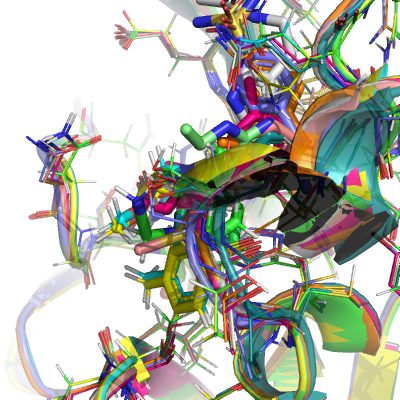
## DAR-DIA-fb2-10_ACR2

* SMILES: *CCC(=O)N1CCN(Cc2cc(F)cc3c2CC=C3CCNC(C)=O)CC1
* hits: x0104,x0195,x0305,x0830
* atom count: 26 common with hits out of 27

| model | RMSD [Å] | Score [kcal/mol] |
| --- | --- | --- |
| placed | 0.937660424 | 2878.075342 | 
| minimised | 7.081237079 | -0.425811171 | 
| docked | 7.815889427 | 0.532518958 | 

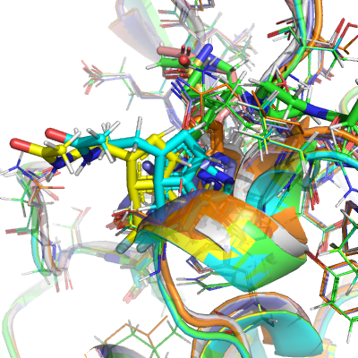
## DAR-DIA-fb2-15_ACR3

* SMILES: *CCC(=O)NCCc1c[nH]c2c(CN3CCN(C(=O)CCl)CC3)cc(Cl)cc12
* hits: x0104,x0195,x0305,x0830
* atom count: 25 common with hits out of 28

| model | RMSD [Å] | Score [kcal/mol] |
| --- | --- | --- |
| placed | 0.941036174 | 862.965386 | 
| minimised | 7.484803412 | -0.447608224 | 
| docked | 7.627660766 | 0.039419935 | 

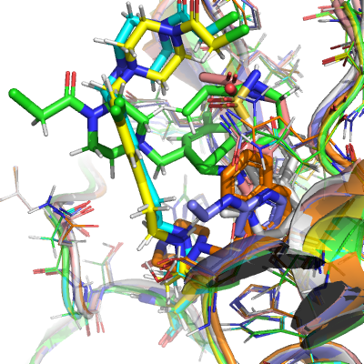
## NIM-UNI-43f-9_NIT2

* SMILES: *C(=N)CN1CCC(c2ccc(OC(C)=O)cc2)OC1
* hits: x0759
* atom count: 12 common with hits out of 19

| model | RMSD [Å] | Score [kcal/mol] |
| --- | --- | --- |
| placed | 0.280413216 | 77.15123198 | 
| minimised | 6.693369811 | -0.457730027 | 
| docked | 6.548467302 | 0.082971582 | 

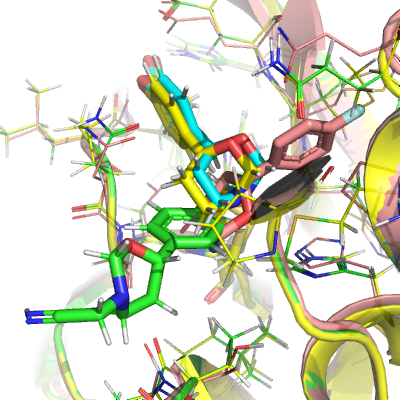
## GIA-UNK-995-6_ACR3

* SMILES: *CCC(=O)N1CCC(C(=O)SCF)CC1
* hits: x1334
* atom count: 9 common with hits out of 15

| model | RMSD [Å] | Score [kcal/mol] |
| --- | --- | --- |
| placed | 0.646125472 | 711.4129068 | 
| minimised | 2.994261532 | -0.458845455 | 
| docked | 2.740772724 | 0.754658376 | 

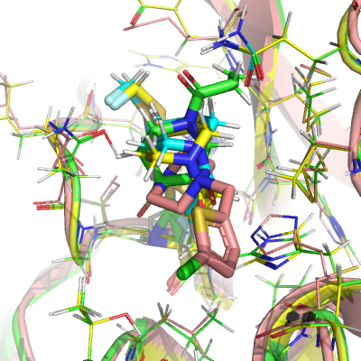
## DAV-CRI-e1c-1_NIT3

* SMILES: *C(=N)CNC(CC(N)=O)C1CN(C(O)CCl)CCN1C(C)O
* hits: x0981,x1493
* atom count: 16 common with hits out of 22

| model | RMSD [Å] | Score [kcal/mol] |
| --- | --- | --- |
| placed | 0.571394687 | 1082.361209 | 
| minimised | 6.392179501 | -0.473258917 | 
| docked | 6.225179063 | 0.974894863 | 

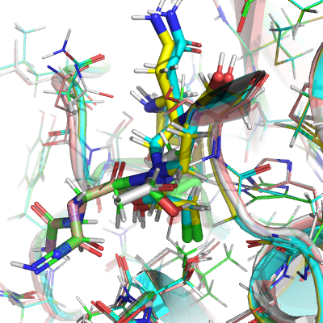
## BEN-VAN-d8f-27_NIT3

* SMILES: *C(=N)CN1CCC(Oc2cc(F)cc3c(CCC)c[nH]c23)CC1
* hits: x0104,x0107,x0946,x0995
* atom count: 12 common with hits out of 23

| model | RMSD [Å] | Score [kcal/mol] |
| --- | --- | --- |
| placed | 0.888163414 | 4287.121622 | 
| minimised | 5.061762878 | -0.484084579 | 
| docked | 5.044618587 | 1.318141061 | 

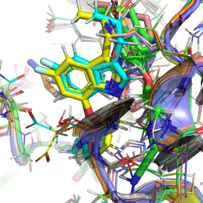
## KIM-UNI-7d1-3_ACR3

* SMILES: *CCC(=O)Nc1ccc(Cl)cc1CN1CCN(C(C)=O)CC1
* hits: x0305,x0770
* atom count: 20 common with hits out of 22

| model | RMSD [Å] | Score [kcal/mol] |
| --- | --- | --- |
| placed | 0.64203637 | 586.0931318 | 
| minimised | 6.962089988 | -0.487259554 | 
| docked | 6.802772023 | 0.591769342 | 

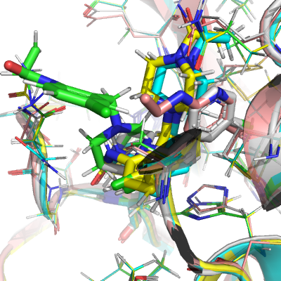
